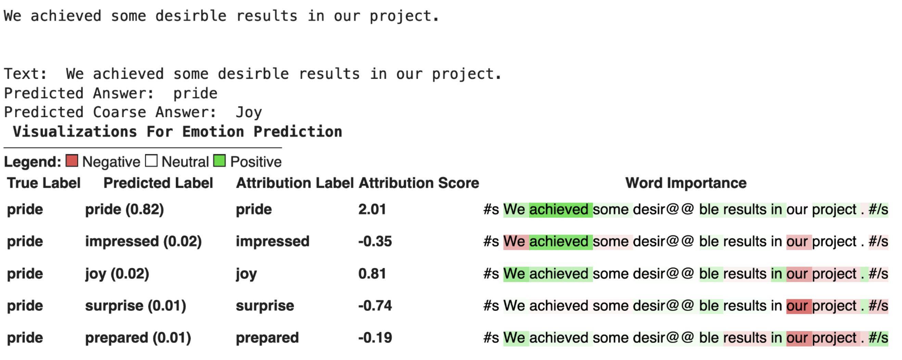
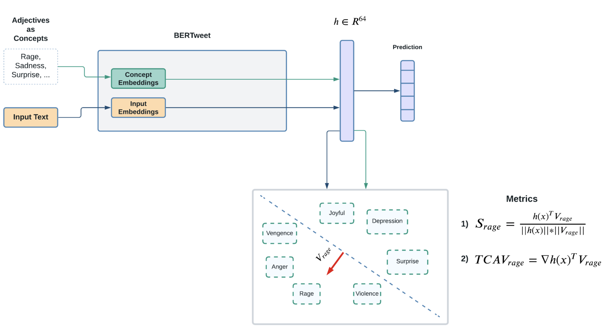
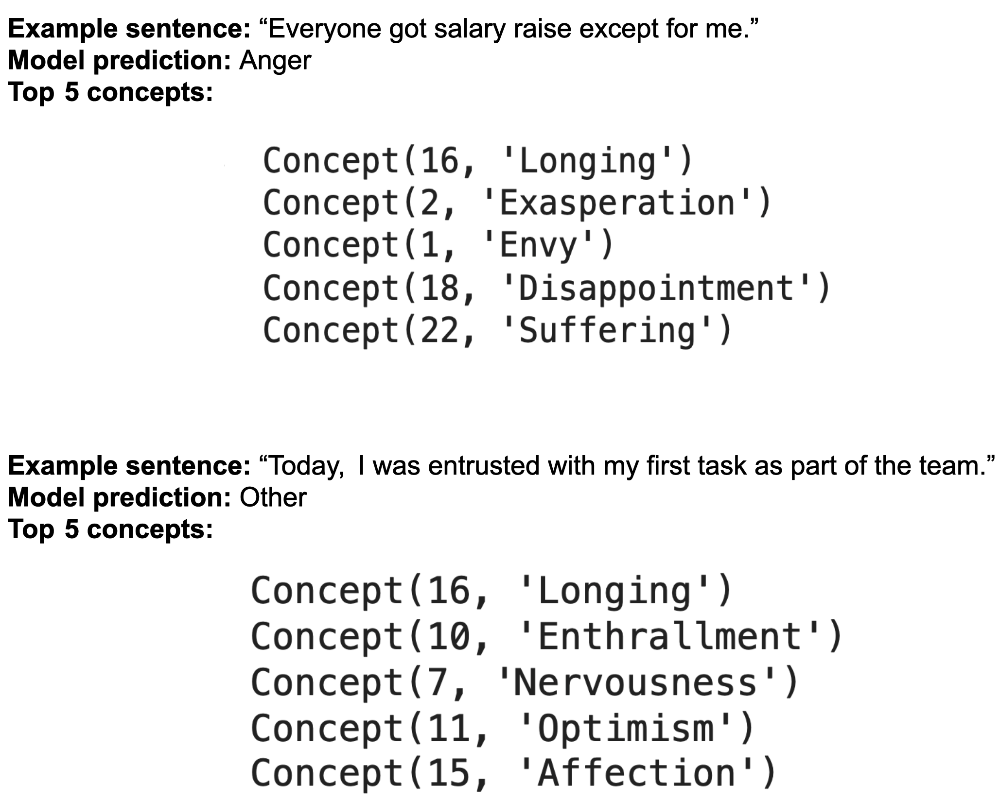

# Explainable Emotion Detection

The goal of the project is to leverage explainable AI (XAI) techniques to understand how language models perceive emotions in conversational text. Thus, a pre-trained large transformer ([BERTweet](https://github.com/VinAIResearch/BERTweet)) was fine-tuned for emotion classification on a Empathetic Dialogues dataset containing paired (text, emotion) data points. Tow models were trained for the task, one that classifies very broad emotions such as sad, happy, etc. The other classifies fine-grained emotions such as rage, envy, dissapointment, etc. After this, a post hoc analysis was performed to gain insights on how the model understands emotions in given input texts. Explainable emoion classification helps reveal the reasons behind predictions and can also reveal potential biases or spurious relationships in the data. Moreover, XAI is important in debugging models to make sure they behave in an expected manner.

## Attribution Explanations

This class of XAI methods attempts to analyze the sensitivity of the predictions with respect to the inputs. So, inputs that contribute to the score of the predicted class can be separated from the whole input. A general method used both in computer vision and NLP is the Integrated Gradients which can reveal sensitive words in given input by using gradient information from the model.

  

## Concept Explanations

This class of XAI methods seek to find human-readeble set of ideas and quantify sensitivity of the model to those. One of the most prominent techniques is TCAV (Testing With Concept Activation Vectors). TCAV explores the embedding space of the trained model to build ideas and concepts in that space. First, a set of predefined inputs which represent an idea are fed to the model. Then, the embeddings of those inputs are linearly separated from embeddings of other inputs using a classifier such as SVM. After this is done, we can compute how the model behaves when moving the embeddings towards a concept. Below is an example of how TCAV is used for emotion classification. Concepts are built using words describing various emotions. Then, we see how sensitive the score of the output class is with respect to each of the defined concepts. If there is high sensitivity, then the model sees the given concept in the input.

  

### Example Concept Discovery

Here are some samples of concept discovery in the inputs. After building separate spaces for each concept in the embedding space, we test the sensitivity of the input embedding towards each of the subspaces of the concepts and report most sensitive concepts. We can see that various emotional concepts are revealed in the input through this method.

  

